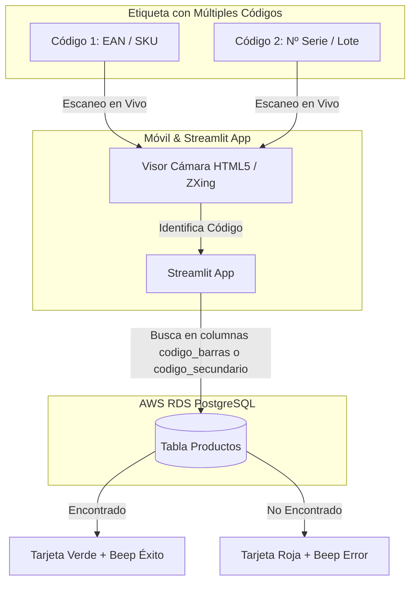

# Plan de Implementación: Escáner de Código de Barras con Streamlit, PostgreSQL (AWS RDS) y Móvil

Aplicación web desplegada globalmente en Streamlit Cloud y orientada a movilidad internacional. Permite la lectura de etiquetas con **uno o múltiples códigos de barras** mediante el visor en tiempo real del smartphone, consultando la base de datos en AWS RDS y ofreciendo respuesta inmediata con sonido y color.

## Arquitectura y Soporte para Múltiples Códigos

## Manejo de Etiquetas Complejas

> [!IMPORTANT]
> **Estrategia para etiquetas con varios códigos de barras:**
> Cuando una etiqueta tiene múltiples códigos (p. ej. Código de producto, Número de Serie, Lote, GS1-128):
> 1. **Detección Dinámica:** El escáner capturará el código al que apuntes. Si hay varios en la misma vista, leerá el primero detectado y mostrará en pantalla qué código ha leído.
> 2. **Búsqueda Flexible en BD:** La consulta SQL en PostgreSQL buscará la coincidencia en cualquiera de los campos habilitados (`codigo_barras`, `codigo_secundario`, `sku` o `numero_serie`).
> 3. **Filtro opcional:** Se puede configurar la app para ignorar códigos que no cumplan un formato específico si fuera necesario.

---

## Componentes del Proyecto

Ubicación del proyecto: `C:\Users\03010496\.gemini\antigravity\scratch\streamlit_barcode_aws`

### Componentes Creados

#### [app.py](file:///C:/Users/03010496/.gemini/antigravity/scratch/streamlit_barcode_aws/app.py)
- Visor en vivo con `html5-qrcode` y selector de cámara (cámara trasera/principal del móvil).
- Manejo de etiquetas con múltiples códigos y visualización clara del código decodificado en pantalla.
- Renderizado de tarjeta de estado (Verde = Encontrado en RDS, Rojo = No Encontrado).
- Sistema de alerta sonora (Beep agudo para éxito, Beep grave para error) compatible con iOS/Android.

#### [db.py](file:///C:/Users/03010496/.gemini/antigravity/scratch/streamlit_barcode_aws/db.py)
- Conexión a PostgreSQL (AWS RDS) con `psycopg` / `psycopg2-binary`.
- Consulta multi-campo (`WHERE codigo_barras = %s OR codigo_secundario = %s OR sku = %s`).

#### [upload_data.py](file:///C:/Users/03010496/.gemini/antigravity/scratch/streamlit_barcode_aws/upload_data.py)
- Script ejecutable localmente para crear la tabla `productos` con soporte para múltiples códigos e insertar registros desde CSV/Excel a AWS RDS.

#### [.streamlit/secrets.toml.template](file:///C:/Users/03010496/.gemini/antigravity/scratch/streamlit_barcode_aws/.streamlit/secrets.toml.template)
- Plantilla de configuración de credenciales de AWS RDS.

#### [requirements.txt](file:///C:/Users/03010496/.gemini/antigravity/scratch/streamlit_barcode_aws/requirements.txt)
- Dependencias (`streamlit`, `psycopg2-binary`, `zxing-cpp`, `pillow`, `pandas`).

#### [README.md](file:///C:/Users/03010496/.gemini/antigravity/scratch/streamlit_barcode_aws/README.md)
- Guía completa de configuración en AWS RDS, despliegue en Streamlit Cloud y pruebas de escaneo.

---

## Plan de Verificación

1. Verificar que el escáner detecte diferentes tipos de códigos de barras (1D EAN, Code 128, DataMatrix, QR).
2. Probar la búsqueda en PostgreSQL con múltiples columnas de códigos.
3. Probar la respuesta visual (Verde/Rojo) y la reproducción sonora al instante.
